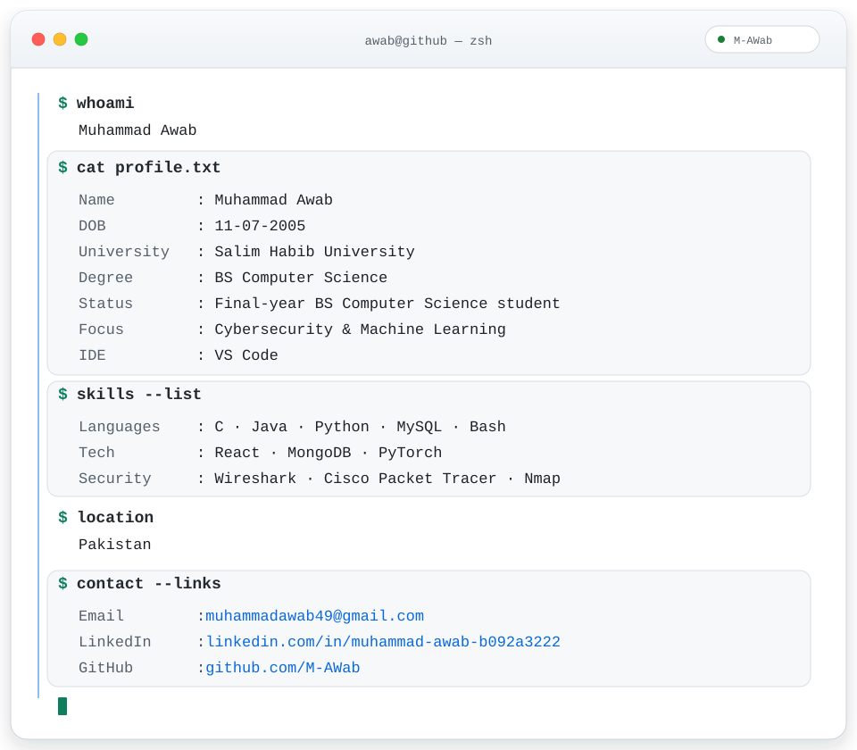

  <picture>
    <source media="(prefers-color-scheme: dark)" srcset="./assets/terminal-dark.svg">
    <source media="(prefers-color-scheme: light)" srcset="./assets/terminal-light.svg">
    
  </picture>

<h1 align="center">Muhammad Awab</h1>

---

  <strong>Final-year BS Computer Science student · Cybersecurity &amp; Machine Learning</strong>

 

  <picture>
    <source media="(prefers-color-scheme: dark)" srcset="https://raw.githubusercontent.com/M-AWab/M-AWab/output/github-contribution-snake-dark.svg">
    <source media="(prefers-color-scheme: light)" srcset="https://raw.githubusercontent.com/M-AWab/M-AWab/output/github-contribution-snake.svg">
    
  </picture>

  <a href="mailto:muhammadawab49@gmail.com">Email</a>
  ·
  <a href="https://www.linkedin.com/in/muhammad-awab-b092a3222/">LinkedIn</a>
  ·
  <a href="https://github.com/M-AWab">GitHub</a>

